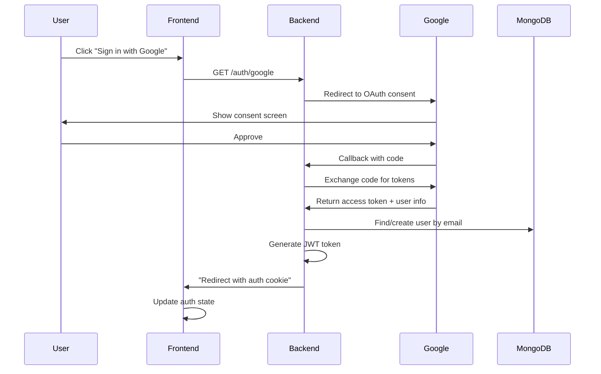

# Add Google OAuth Authentication

## Architecture Overview




## Backend Changes

### 1. Add Dependencies

**File:** `[backend/go.mod](backend/go.mod)`

Add Google OAuth library:

```bash
go get golang.org/x/oauth2
go get golang.org/x/oauth2/google
```

### 2. Update Configuration

**File:** `[backend/internal/config/config.go](backend/internal/config/config.go)`

Add OAuth config fields:

- `GoogleClientID` (from env: `GOOGLE_CLIENT_ID`)
- `GoogleClientSecret` (from env: `GOOGLE_CLIENT_SECRET`)
- `GoogleRedirectURL` (from env: `GOOGLE_REDIRECT_URL`, default: `http://localhost:8080/auth/google/callback`)

**File:** `[backend/.env](backend/.env)`

Add environment variables:

```
GOOGLE_CLIENT_ID=your-client-id.apps.googleusercontent.com
GOOGLE_CLIENT_SECRET=your-client-secret
GOOGLE_REDIRECT_URL=http://localhost:8080/auth/google/callback
```

### 3. Update User Model

**File:** `[backend/internal/models/user.go](backend/internal/models/user.go)`

The `OAuth` struct already exists (lines 25-31) but needs to be activated:

- Keep existing structure with `Provider`, `ProviderID`, `AccessToken`, etc.
- Ensure `User.OAuth` field is properly used
- OAuth users should have `EmailVerified: true` by default

### 4. Create OAuth Service

**New File:** `backend/internal/services/oauth_service.go`

Responsibilities:

- Initialize Google OAuth2 config with client ID, secret, redirect URL, and scopes (`email`, `profile`)
- `GetGoogleAuthURL(state)` - generates OAuth consent URL with CSRF state token
- `ExchangeGoogleCode(code)` - exchanges authorization code for access token
- `GetGoogleUserInfo(token)` - fetches user profile from Google API
- `HandleGoogleCallback(code, state)` - orchestrates the full callback flow:
  - Exchange code for token
  - Get user info from Google
  - Find existing user by email OR create new user
  - If user exists with password, link OAuth account (update `OAuth` field)
  - If new user, create with `EmailVerified: true`, `Role: "user"`, populate `OAuth` field
  - Return JWT token for frontend

### 5. Create OAuth Handler

**New File:** `backend/internal/handlers/oauth_handler.go`

Handlers:

- `GoogleLogin(c *gin.Context)` - initiates OAuth flow:
  - Generate CSRF state token (store in session/Redis with expiry)
  - Redirect to Google consent URL
- `GoogleCallback(c *gin.Context)` - handles OAuth callback:
  - Validate state token (prevent CSRF)
  - Call `oauthService.HandleGoogleCallback()`
  - Set JWT token in HTTP-only cookie (same as regular login)
  - Redirect to frontend success URL (e.g., `http://localhost:4200/auth/callback?success=true`)

### 6. Add OAuth Routes

**File:** `[backend/internal/routes/routes.go](backend/internal/routes/routes.go)`

Add public OAuth routes (after line 35, in public routes section):

```go
auth.GET("/google", oauthHandler.GoogleLogin)
auth.GET("/google/callback", oauthHandler.GoogleCallback)
```

Future-proof for other providers: `/auth/github`, `/auth/discord`, etc.

### 7. Update User Repository

**File:** `[backend/internal/repositories/user_repository.go](backend/internal/repositories/user_repository.go)`

Add methods (if not present):

- `FindByProviderID(provider, providerID)` - find user by OAuth provider ID
- Ensure `FindByEmail()` works for OAuth users

### 8. Wire Dependencies

**File:** `[backend/cmd/api/main.go](backend/cmd/api/main.go)`

Initialize services and handlers:

```go
oauthService := services.NewOAuthService(userRepo, cfg)
oauthHandler := handlers.NewOAuthHandler(oauthService)
```

Pass `oauthHandler` to `SetupRouter()`.

## Frontend Changes

### 1. Add OAuth Configuration

**File:** `[frontend/src/environments/environment.ts](frontend/src/environments/environment.ts)`

Add backend OAuth URLs:

```typescript
googleAuthUrl: `${apiUrl}/auth/google`
```

### 2. Update Auth Service

**File:** `[frontend/src/app/services/auth.ts](frontend/src/app/services/auth.ts)`

Add methods:

- `loginWithGoogle()` - redirect to backend OAuth endpoint:
  ```typescript
  window.location.href = environment.googleAuthUrl;
  ```
- No need for callback handling - backend redirects back with cookie set

### 3. Add Google Sign-In Button

**File:** `[frontend/src/app/components/login/login.component.html](frontend/src/app/components/login/login.component.html)`

Add "Sign in with Google" button after existing login form:

- Use Angular Material button with Google icon
- Call `authService.loginWithGoogle()` on click
- Style with Google brand colors (#4285F4, white text)
- Add divider with "OR" text between email/password and Google button

**Similar changes for:** `[frontend/src/app/components/register/register.component.html](frontend/src/app/components/register/register.component.html)`

### 4. OAuth Callback Route (Optional)

**File:** `[frontend/src/app/app.routes.ts](frontend/src/app/app.routes.ts)`

Add callback route (if you want intermediate success page):

```typescript
{
  path: 'auth/callback',
  component: OAuthCallbackComponent,
  canActivate: [authGuard]
}
```

**Optional Component:** `frontend/src/app/components/oauth-callback/oauth-callback.component.ts`

- Show loading spinner
- Check auth status via `authService.checkAuthStatus()`
- Redirect to `/challenges` after auth confirmation

### 5. Add Google Icon

**Option A:** Use Angular Material icon (if available)
**Option B:** Use SVG or PNG Google logo
**Option C:** Use Font Awesome or similar icon library

## Google Cloud Console Setup

### Prerequisites (User must do this):

1. **Create Google Cloud Project**
  - Go to [https://console.cloud.google.com](https://console.cloud.google.com)
  - Create new project or select existing
2. **Enable Google+ API**
  - Navigate to "APIs & Services" > "Library"
  - Search for "Google+ API" and enable
3. **Create OAuth Credentials**
  - Go to "APIs & Services" > "Credentials"
  - Click "Create Credentials" > "OAuth 2.0 Client ID"
  - Application type: Web application
  - Authorized redirect URIs:
    - Development: `http://localhost:8080/auth/google/callback`
    - Production: `http://148.100.79.152:8080/auth/google/callback`
  - Copy Client ID and Client Secret
4. **Configure OAuth Consent Screen**
  - Set application name, logo, support email
  - Add scopes: `email`, `profile`
  - Add test users (for development)

## Security Considerations

1. **CSRF Protection:** Use state parameter with expiring tokens (store in Redis)
2. **Token Storage:** JWT in HTTP-only cookies (consistent with existing auth)
3. **Secure Cookies:** Set `Secure: true` in production (HTTPS required)
4. **Token Refresh:** Store Google refresh token for long-lived access (if needed)
5. **Email Verification:** OAuth users marked as verified automatically

## Testing Strategy

1. **Backend Unit Tests:**
  - Mock Google OAuth responses
  - Test user creation with OAuth
  - Test linking existing accounts
2. **Integration Tests:**
  - Test full OAuth flow with mock OAuth server
  - Test state validation
  - Test error handling (declined consent, invalid code)
3. **Manual Testing:**
  - Sign up new user via Google
  - Sign in existing user (by email) via Google
  - Verify cookie is set and user is authenticated
  - Test on both localhost and production domain

## Extensibility for Future Providers

The `oauth_service.go` should be structured to support multiple providers:

```go
type OAuthProvider interface {
    GetAuthURL(state string) string
    ExchangeCode(code string) (*oauth2.Token, error)
    GetUserInfo(token *oauth2.Token) (*OAuthUserInfo, error)
}
```

Implementations: `GoogleProvider`, `GitHubProvider`, `DiscordProvider`, etc.

For now, implement Google directly, but use interface-friendly patterns for easy extension.

## Files to Create

- `backend/internal/services/oauth_service.go` (OAuth business logic)
- `backend/internal/handlers/oauth_handler.go` (HTTP handlers)
- `frontend/src/app/components/oauth-callback/oauth-callback.component.ts` (optional)
- `frontend/src/app/components/oauth-callback/oauth-callback.component.html` (optional)

## Files to Modify

Backend:

- `[backend/go.mod](backend/go.mod)` - add dependencies
- `[backend/internal/config/config.go](backend/internal/config/config.go)` - add OAuth config
- `[backend/.env](backend/.env)` - add OAuth credentials
- `[backend/internal/routes/routes.go](backend/internal/routes/routes.go)` - add OAuth routes
- `[backend/cmd/api/main.go](backend/cmd/api/main.go)` - wire OAuth dependencies
- `[backend/internal/repositories/user_repository.go](backend/internal/repositories/user_repository.go)` - add OAuth query methods

Frontend:

- `[frontend/src/environments/environment.ts](frontend/src/environments/environment.ts)` - add OAuth URLs
- `[frontend/src/environments/environment.prod.ts](frontend/src/environments/environment.prod.ts)` - add OAuth URLs
- `[frontend/src/app/services/auth.ts](frontend/src/app/services/auth.ts)` - add Google login method
- `[frontend/src/app/components/login/login.component.ts](frontend/src/app/components/login/login.component.ts)` - add Google login handler
- `[frontend/src/app/components/login/login.component.html](frontend/src/app/components/login/login.component.html)` - add Google button
- `[frontend/src/app/components/register/register.component.ts](frontend/src/app/components/register/register.component.ts)` - add Google signup handler
- `[frontend/src/app/components/register/register.component.html](frontend/src/app/components/register/register.component.html)` - add Google button
- `[frontend/src/app/app.routes.ts](frontend/src/app/app.routes.ts)` - add callback route (optional)

